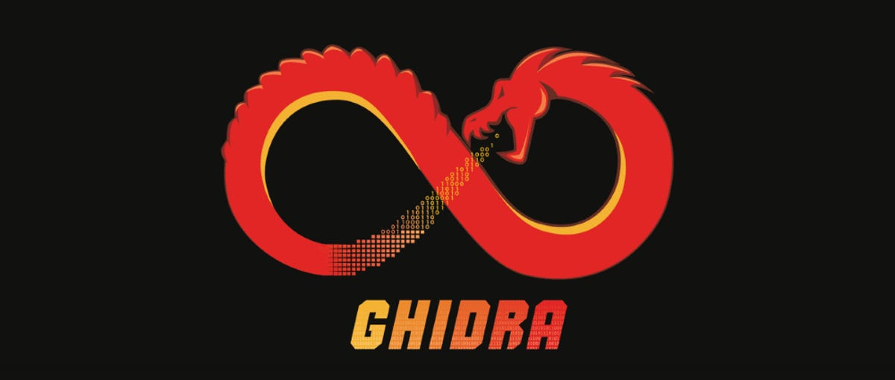

# Hi, I'm mystergaif 👋

### 🛠 Reverse Engineer | Rust / C / C++ Developer | DevOps

---

## 🐲 Binary Analysis & Tools

  
    
   
  &nbsp;&nbsp;
  

> Exploring the depths of binaries, memory management, and system security.

---

## 🐍 Contribution Snake

---

## 📊 Performance & Stats

  
   
  

---

### ⚡ Quick Info
- 🦀 **Currently:** Hardening my Rust skills
- ☕ **Java:** Analyzing bytecode & decompilation
- 🔍 **Focus:** Low-level development & Vulnerability research
- 🐧 **OS:** Linux is my primary environment
